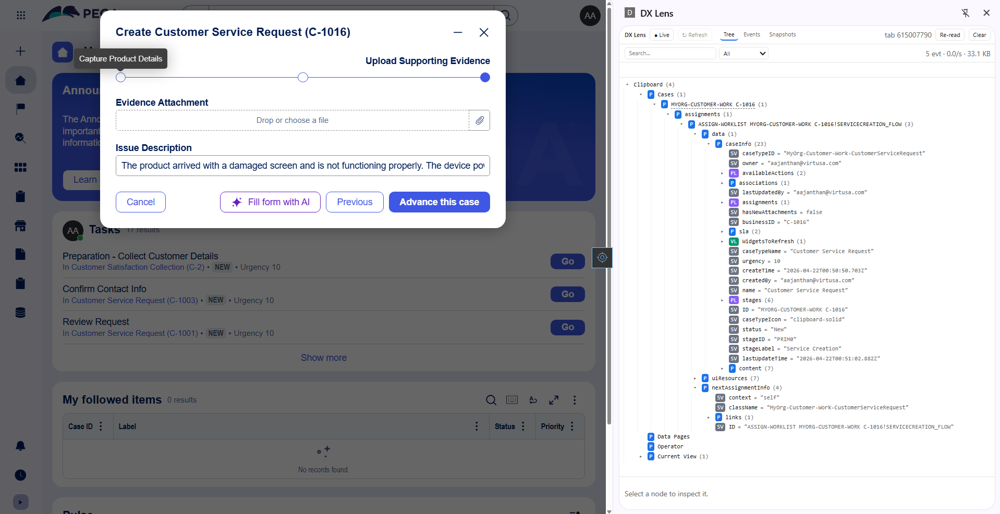

<div align="center">


# DX Lens

**The classic Pega Clipboard — for Constellation apps, in your side panel.**
*Local-only. Zero egress. Read-only.*

[](#running-tests)
[](./LICENSE)
[](./manifest.json)
[](#install)
[](#install)

</div>

---

## What is this?

If you've worked in Pega's classic portal, you know the **Clipboard** — a live tree of the runtime state (cases, data pages, operator, current view) that made debugging feel like a conversation with the platform. Constellation removed it.

**DX Lens rebuilds it** on top of Constellation's DX API layer. It observes the network traffic your browser is already making, assembles it into a unified clipboard tree, and renders it in Chrome's side panel — searchable, expandable, diffable.

<div align="center">



<sub><em>DX Lens side panel (right) showing the live clipboard tree for a Customer Service Request case in Constellation (left).</em></sub>

</div>

> [!NOTE]
> **Experimental release.** v1.x is published to gather feedback from the Pega developer community. Expect rough edges — please file issues.

---

## Privacy guarantees

These are **product features**, not aspirations.

| | |
|---|---|
| 🚫 **Zero outbound network requests** | From the extension itself. No telemetry, no analytics, no update pings. Enforced by [`tests/no-egress.test.js`](./tests/no-egress.test.js). |
| 🗑️ **Zero persistent storage** of captured data | Clipboard state, snapshots, events live in memory, scoped to the tab. Tab close discards everything. Only *your preferences* persist (via `chrome.storage.local`). |
| 👀 **Read-only** interaction with Pega | DX Lens observes; it never modifies requests or responses. The Refresh button re-issues a GET the app would itself issue — nothing more. |

Full threat model in [`specs/07-privacy-security.md`](./specs/07-privacy-security.md). Full privacy policy in [`PRIVACY.md`](./PRIVACY.md).

---

## Features

- **Unified tree** — Cases, Assignments, Data Pages, Operator, Current View, all in one view.
- **Property-mode badges** — SV / P / PL / VL, with tentative-mode marker for empty arrays, just like classic.
- **Snapshot + diff** — take a snapshot before an action, another after, see exactly what changed. PL items correlate by `pzInsKey`.
- **Auto-snapshot on screen change** — every time you navigate to a new view, the previous screen's state is preserved as a snapshot. (Toggle in Options.)
- **Search** — over node names, values, and paths. Scopes: all / current case / current view / data pages / operator. 80 ms debounce, <50 ms on a 10k-node tree.
- **Events log** — every DX request/response with timing, status, and body preview.
- **Live / Pause toggle** — freeze the tree while you investigate, with a queued-count badge.
- **1-indexed dotted paths** — matches classic clipboard muscle memory (`Customer.Address(1).City`).
- **Options page** — URL patterns, snapshot cap, body-size limit, theme, reduced motion.

---

## Install

### From source (unpacked)

1. Clone this repository.
2. Open `chrome://extensions` and toggle **Developer mode**.
3. Click **Load unpacked** and select the repository root.
4. Pin the DX Lens toolbar icon, open any Pega Constellation app, and click the icon to open the side panel.

### Chrome Web Store

Pending review. GitHub releases will carry the download link once published.

### Firefox (via `about:debugging`)

Firefox 128+ is supported (manifest declares `browser_specific_settings.gecko.id`). Load as a temporary add-on from `about:debugging`.

---

## How it works

```
Pega Constellation tab
  │
  │  ┌─ injected.js ──────────┐  wraps window.fetch + XMLHttpRequest
  │  │   (page MAIN world)    │  at document_start
  │  └─────────┬──────────────┘
  │            │  postMessage { __dxlens__, event }
  │            ▼
  │  ┌─ content.js ───────────┐
  │  │   (page isolated world)│
  │  └─────────┬──────────────┘
  │            │  chrome.runtime.sendMessage
  │            ▼
  │  ┌─ background.js ────────────────────────────────┐
  │  │   (service worker)                             │
  │  │   • per-tab event buffer (cap 500, FIFO)       │
  │  │   • classify + merge into clipboard tree       │
  │  │   • snapshot store (cap configurable)          │
  │  │   • tool-layer dispatch (v2 Day 2 foundation)  │
  │  └───────────────────────┬────────────────────────┘
  │                          │  long-lived port
  └──────────────────────────▼──────────────────────────
                   ┌─ sidepanel.html ─┐
                   │   Tree / Events /│
                   │   Snapshots /    │
                   │   Diff / Search  │
                   └──────────────────┘
```

Details in [`specs/06-architecture.md`](./specs/06-architecture.md).

---

## Running tests

Node 18+ required. No dependencies, no build step.

```bash
node tests/run.js
```

Or run a single suite:

```bash
node tests/clipboard.test.js
```

**Release gates** enforced by the test suite:

| Gate | File |
|---|---|
| No outbound network calls from extension code | [`no-egress`](./tests/no-egress.test.js) |
| WCAG AA contrast on both themes | [`color-contrast`](./tests/color-contrast.test.js) |
| Search latency < 50 ms on a 10k-node tree | [`search`](./tests/search.test.js) |
| Single-case merge latency gate | [`perf-merge`](./tests/perf-merge.test.js) |
| 1-indexed dotted-path grammar round-trip | [`path`](./tests/path.test.js) |
| Pattern-list drift across injected/bench/shared module | [`patterns`](./tests/patterns.test.js) |
| i18n catalog sync between `.json` and `.js` | [`i18n`](./tests/i18n.test.js) |
| Tracker consistency vs. source tree and test set | [`tracker`](./tests/tracker.test.js) |

---

## Roadmap

- **Day 1 · v1.x** — Clipboard tree, snapshot + diff, search, side panel. No AI.
- **Day 2 · v2.x** — Local-LLM debugging copilot layered on the same tool primitives. Explain-only, read-only, citations mandatory. **No hosted LLM support** — local only, by design.

Per-module status lives in [`TRACKER.md`](./TRACKER.md).

---

## Architectural commitments

Decisions that are made and won't be revisited without explicit approval:

1. **Manifest V3.** V2 is dead.
2. **MAIN-world fetch/XHR interception.** Not `chrome.webRequest` (can't read response bodies on MV3). Not `chrome.debugger` (intrusive).
3. **Zero outbound network requests** from the extension itself — ever.
4. **No persistent storage** of captured data.
5. **Read-only tool layer** — no write/action tools, permanently.
6. **Local LLM only for Day 2.** No hosted LLM support. Fork if needed.

See [`CLAUDE.md`](./CLAUDE.md) and [`specs/10-decisions.md`](./specs/10-decisions.md) for the full register.

---

## Contributing

- No CLA required.
- Contributions governed by the Developer Certificate of Origin (DCO).
- See [`CONTRIBUTING.md`](./CONTRIBUTING.md) for details.

---

## Licensing

- **Code:** MIT — see [`LICENSE`](./LICENSE).
- **Specs, knowledge base, tracker:** CC-BY 4.0.

---

## Security

Please report vulnerabilities privately. See [`SECURITY.md`](./SECURITY.md).

---

## Credits

Created by **Ajanthan Jeyakumar**.

"Pega" is used descriptively. DX Lens is not affiliated with Pegasystems Inc.
