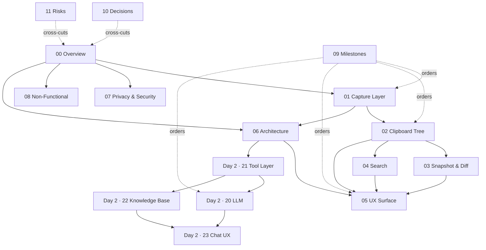

# Specification Dependencies

This document shows which specs depend on which others, so implementation can proceed in the right order and reviewers know what context they need.

A dependency `A → B` means: spec A should be read (and, when implementing, completed) before spec B.

## Dependency graph

## Implementation order (Day 1)

Derived from the graph above, with milestone alignment:

| Order | Spec | Milestone |
|---|---|---|
| 1 | 01 Capture Layer | M1 |
| 2 | 02 Clipboard Tree | M2 |
| 3 | 06 Architecture (scaffolding done in parallel with 01/02) | M1–M2 |
| 4 | 07 Privacy & Security (verified continuously) | M1+ |
| 5 | 03 Snapshot & Diff | M3 |
| 6 | 04 Search | M3 |
| 7 | 05 UX Surface | M3 |
| 8 | 08 Non-Functional (verified at gate) | M4 |

## Implementation order (Day 2)

Day 2 begins only after v1.x is stable (M5 complete).

| Order | Spec | Milestone |
|---|---|---|
| 1 | 21 Tool Layer (harden v1 contracts, expose externally) | M6 |
| 2 | 22 Knowledge Base | M6 |
| 3 | 20 LLM Integration | M6–M7 |
| 4 | 23 Chat UX & Citations | M7 |

## Cross-cutting specs

These apply to every implementation unit and are not in the linear order:

- **10 Decisions** — consulted whenever a design choice is being made. Updated when new decisions are taken.
- **11 Risks** — consulted during implementation planning and at milestone gates.
- **09 Milestones** — the delivery frame; specs are organized by milestone in the table above.

## Reading dependencies vs. implementation dependencies

Not all reading dependencies are build dependencies:

- **Read** 00 Overview before anything else for context.
- **Read** 07 Privacy & Security before writing any code that touches network or storage.
- **Build** 01 Capture Layer before 02 Clipboard Tree because the tree merge logic consumes capture events; but you can **read** them in either order.

## When dependencies change

If a PR adds a new cross-spec dependency, update this document in the same PR. The Mermaid diagram is the source of truth — keep it current.
